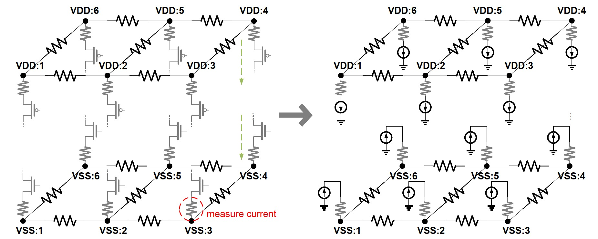
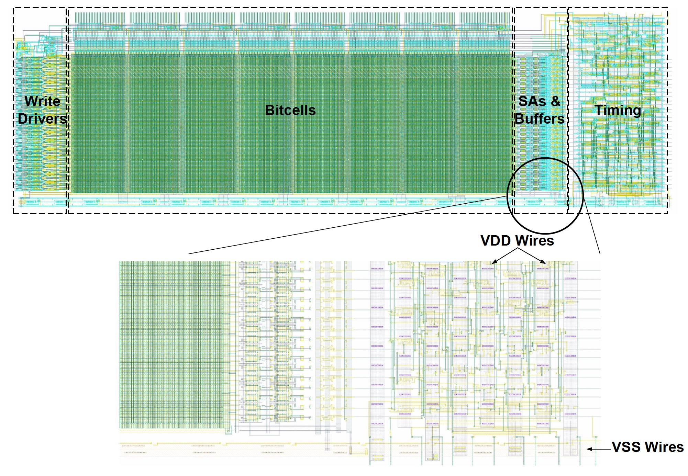
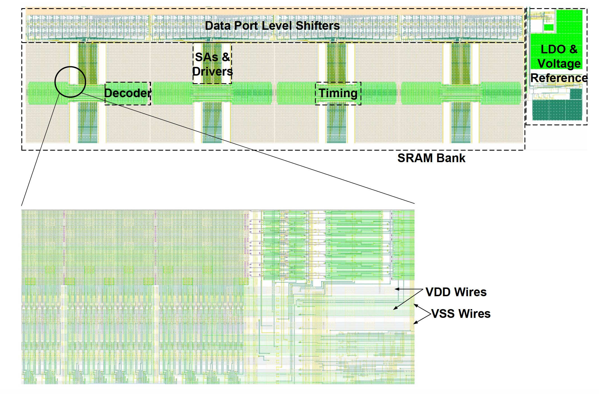
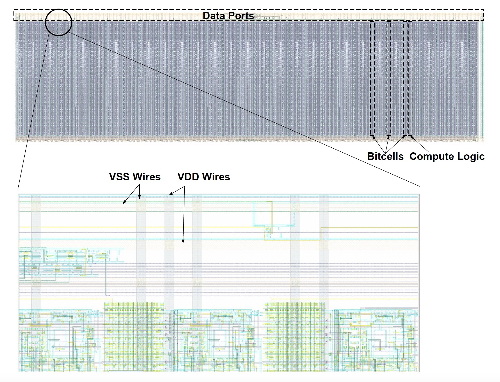
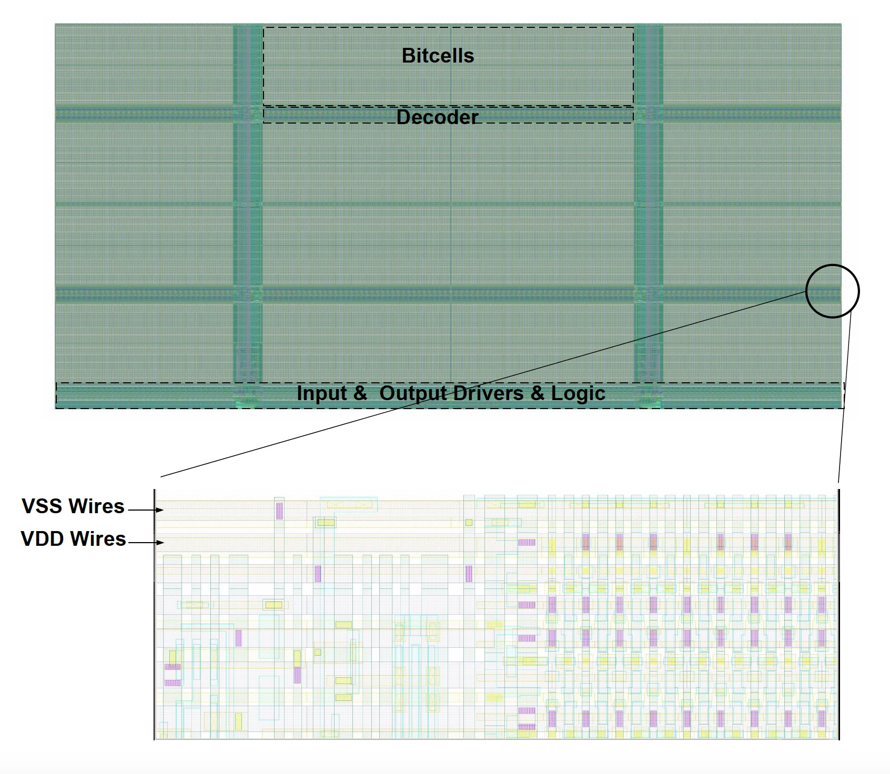

# SRAM-PG
## A benchmark suite for power delivery network analysis
Designing the power delivery network (PDN) in very large-scale integrated (VLSI) circuits is increasingly important, especially for nowadays low-power integrated circuit (IC) design.  
To this end, we construct and release a set of PDN benchmarks (named **SRAM-PG**) from SRAM circuit design in this work. The benchmarks are obtained from realistic and state-of-the-art SRAM designs, following a workflow for generating the post-layout PDN netlists with full RC parasitics. With careful modeling of load currents, the benchmarks reflect the dynamic work mode of the IC and can be used for both transient and DC analysis. The benchmarks are derived from the designs for diverse applications. And, sharing them in the public domain with detailed descriptions would largely benefit the relevant research.  

## Download
You may install git lfs first. Check lfs doc [here](https://git-lfs.com/).  
All netlist and simulation results are also available at [Google Drive](https://drive.google.com/drive/folders/1xXOc-613NwobgV0_-4zpV5p0WzbpnhzN?usp=sharing).
## Benchmark Description
### SSRAM
1
SSRAM is a macro of the basic SRAM array used by several timing speculation cache designs <sup>[1-4]</sup>, which boosts the cache frequency and improves energy efficiency under low supply voltages. This design targets at the near-threshold voltage domain and is validated through the tape-out measurement.  
> [1] Shen, Shan, et al. "TS cache: A fast cache with timing-speculation mechanism under low supply voltages." IEEE Transactions on Very Large Scale Integration (VLSI) Systems 28.1 (2019): 252-262.  
[2] Shen, Shan, et al. "Modeling and designing of a PVT auto-tracking timing-speculative SRAM." 2020 Design, Automation & Test in Europe Conference & Exhibition (DATE). IEEE, 2020.  
[3] Shang, Xiaojing, et al. "RRS cache: a low voltage cache based on timing speculation SRAM with a reuse-aware cacheline remapping mechanism." Proceedings of the International Symposium on Memory Systems. 2019.  
[4] Ling, Ming, et al. "A Design of Timing Speculation SRAM-Based L1 Caches With PVT Autotracking Under Near-Threshold Voltages." IEEE Transactions on Very Large Scale Integration (VLSI) Systems 29.12 (2021): 2197-2209.  

### Ultra8T SRAM

Ultra8T SRAM <sup>[5]</sup> is a sub-threshold design that can aggressively reduce the operating voltage by using a leakage detection strategy without any additional hardware overhead.  
> [5] Shen, Shan, et al. "Ultra8T: A Sub-Threshold 8T SRAM with Leakage Detection." arXiv preprint arXiv:2306.08936 (2023).  

### Sandwich-RAM

Sandwich-RAM <sup>[6]</sup> is an in-memory-computing design for binary weight convolutional neural networks that blends feature and partial-weight memory with a computing circuit together, like a sandwich, that achieves significantly fewer data access.  
> [6] Yang, Jun, et al. "24.4 sandwich-RAM: An energy-efficient in-memory BWN architecture with pulse-width modulation." 2019 IEEE International Solid-State Circuits Conference-(ISSCC). IEEE, 2019.  

### SP8192W SRAM

SP8192W SRAM, which is the largest design in this work, is based on a single port 6T cell structure generated by the [ARM SRAM compiler](https://www.arm.com/en/products/silicon-ip-physical/embedded-memory) with tremendously high density. This SRAM is fully compliant with the industry standard with good robustness.  

### Statistical Info.
| Info. | SSRAM | Ultra8T* | Sandwich | SP8192W |
| --- | --- | --- | --- | --- |
| Voltage (V) | 0.5 | 0.4, 0.8 | 0.6 | 0.8 |
| Area ($\mu m^2$) | 3,724 | 226,236.2 | 287,000 | 240,804.5 |
| Metal Layer | M1-M6 | M1-M7 | M1-M6 | M1-M4 |
| #Node | 76,384 | 4,542,355 | 4,969,731 | 5,941,101 |
| #Resistor | 106,796 | 7,103,220 | 7,243,343 | 10,050,878 |
| #Capacitor | 37,506 | 1,783,923 | 4,427,494 | 2,472,252
VDD I Source | 20,602 | 835,346 | 987,966 | 152,477 
VSS I Source | 20,278 | 1,187,316 | 1,309,162 | 2,680,841 

\* Voltage sources are set to 0.4V and 0.8V for low and high voltage domains, respectively.


## Application
The proposed benchmarks support both DC and transient analysis. The corresponding files follow SPICE format.  The DC netlist is
``` 
* parasitic resistors
R<number>	<node>	<node> <value>
* global port connections
R<number>	<node>	VDD	   0.1
* voltage sources
Vpwr	VDD	0	dc	<value>
Vgnd	VSS	0	dc	0
* current sources
I<number>	<node>	0	dc 	<value>
```
And the transient netlist is
```
* parasitic resistors
R<number>	<node>	<node>	<value>
* parasitic coupling capacitors
C<number>	<node>	<node>	<value>
* parasitic ground capacitors
Cg<number>	<node>	0		<value>
* global port connections
R<number>	<node>	VDD		0.1
* voltage sources
Vpwr	VDD	0	dc	<value>
Vgnd	VSS	0	dc	0
* current sources
I<number>	<node>	0	dc 	  <value>
I<number>	<node>	0	pulse (<v1> <v2> <td> <tr> <tf> <pw> <per>)
```
The DC solution file contains all available nodes in the PDN. In the transient solution, we only store the transient solutions of 20 nodes that are randomly picked from the PDN to reduce the size of the solution file.  The key-value pairs are printed for each time step.  


## Note:
- The solutions that we have provided in this version may not be the accurate ones due to the simulator we used. 
- Floating nodes exist in the netlist
